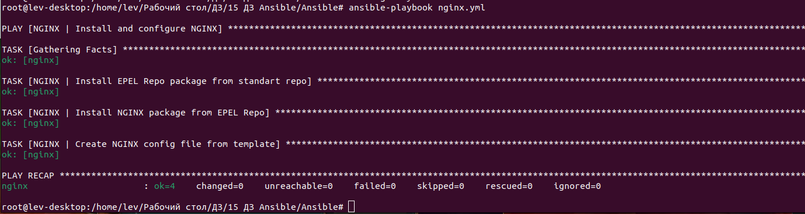
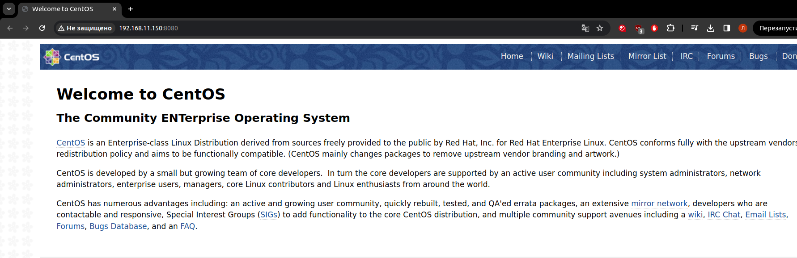

# Автоматизация администрирования. Ansible.

**Задачи:**

* Необходимо использовать модуль yum/apt

* Конфигурационные файлы должны быть взяты из шаблона jinja2 с переменными

* После установки nginx должен быть в режиме enabled в systemd

* Должен быть использован notify длā старта nginx после установки

* Сайт должен слушать на нестандартном порту - 8080, для этого использовать переменные в Ansible

* Сделать все это с использованием Ansible роли

**Домашнее задание считается принятым, если:**

* Предоставлен Vagrantfile и готовый playbook/роль ( инструкция по запуску
стенда, если посчитаете необходимым )

* После запуска стенда nginx доступен на порту 8080

* При написании playbook/роли соблюдены перечисленные в задании условия


**Решение:**

Проверяем версию ансибла
```
ansible --version

ansible 2.10.8
  config file = /home/lev/Рабочий стол/ДЗ/15 ДЗ Ansible/Ansible/ansible.cfg
  configured module search path = ['/root/.ansible/plugins/modules', '/usr/share/ansible/plugins/modules']
  ansible python module location = /usr/lib/python3/dist-packages/ansible
  executable location = /usr/bin/ansible
  python version = 3.10.12 (main, Nov 20 2023, 15:14:05) [GCC 11.4.0]

```

Узнаем где находится SSH ключ

```
vagrant ssh-config
```

Создаем файл hosts

```
vim hosts
```

Создаем ansible.cfg и правим hosts

```
vim ansible.cfg

vim hosts
```

Продолжаем работать по методички (прошу прощения, часть скриншотов утеряна)
 
```
ansible nginx -m ping
```

```
ansible nginx -m command -a "uname -r"
```

```
ansible nginx -m systemd -a name=firewalld
```

```
ansible nginx -m yum -a "name=epel-release state=present" -b
```

```
vim epel.yml
```

```
ansible-playbook epel.yml
```

```
ansible nginx -m yum -a "name=epel-release state=absent" -b
```
```
ansible-playbook epel.yml
```


```
vi NGINX.yml
```

```
ansible-playbook nginx.yml --list-tags
```

```
ansible-playbook nginx.yml -t nginx-package
```


```
vi nginx.yml
```

```
ansible-playbook nginx.yml
```


```
curl http://192.168.11.150:8080

<!DOCTYPE HTML PUBLIC "-//W3C//DTD HTML 4.01 Transitional//EN">
<html>
<head>
  <title>Welcome to CentOS</title>
  <style rel="stylesheet" type="text/css"> 
```

