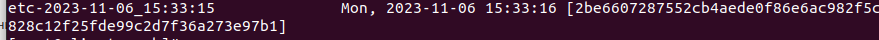

# Резервное копирование

**Цель домашнего задания**

**Настроить стенд Vagrant с двумя виртуальными машинами: backup_server и client. (Студент самостоятельно настраивает Vagrant)
Настроить удаленный бэкап каталога /etc c сервера client при помощи borgbackup**

**Решение**

Создаем ВМ из Vagrantfile

На нашинах client и backup проделываем

```
yum install epel-release -y
yum install borgbackup -y
```
На сервере backup

```
mkdir /var/backup
useradd borg
chown borg:borg /var/backup/
ыu - borg
mkdir .ssh
touch .ssh/authorized_keys
chmod 700 .ssh
chmod 600 .ssh/authorized_keys
```
На клиенте

```
ssh-keygen
```
Копируем данные из id_rsa.pub в /home/borg/.ssh/authorized_keys на сервере

Далее инициализируем репозиторий borg на backup сервере с client сервера и запускам бекап:
```
borg init --encryption=repokey borg@192.168.56.15:/var/backup/
borg create --stats --list borg@192.168.56.15:/var/backup/::"etc-{now:%Y-%m-%d_%H:%M:%S}" /etc
```
Что получилось
```
borg list borg@192.168.56.15:/var/backup/
```

