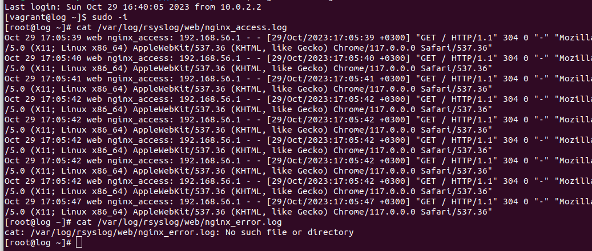

# Сбор и анализ логов

**Цель домашнего задания**

Научится проектировать централизованный сбор логов. Рассмотреть особенности разных платформ для сбора логов.

**Описание домашнего задания**

* В Vagrant разворачиваем 2 виртуальные машины web и log
* На web настраиваем nginx
* На log настраиваем центральный лог сервер на любой системе на выбор
    * journald
    * rsyslog
    * elk
* Настраиваем аудит, следящий за изменением конфигов nginx 

Все критичные логи с web должны собираться и локально и удаленно.
Все логи с nginx должны уходить на удаленный сервер (локально только критичные).
Логи аудита должны также уходить на удаленную систему.

Формат сдачи ДЗ - vagrant + ansible

* Дополнительное задание
    * развернуть еще машину с elk
    * таким образом настроить 2 центральных лог системы elk и какую либо еще;
    * в elk должны уходить только логи нжинкса;
    * во вторую систему все остальное.

**Решение**

Создаем ВМ из Vagrantfile

Настраиваем одинаковое время на машинах web и log

```
vagrant ssh web
sudo -i
cp /usr/share/zoneinfo/Europe/Moscow /etc/localtime
systemctl restart chronyd
systemctl status chronyd

vagrant ssh log
sudo -i
cp /usr/share/zoneinfo/Europe/Moscow /etc/localtime
systemctl restart chronyd
systemctl status chronyd

```


**Установка, настрйока и проверка работы nginx**

```
yum install epel-release
yum install -y nginx
systemctl start nginx
```

Проверяем работу nginx попыткой зайти на веб


**Настройка центрального сервера сбора логов**

```
vagrant ssh log
sudo -i
nano /etc/rsyslog.conf
```


```
systemctl restart rsyslog
```

**Настройка отправки логов с web-сервера**

```
vagrant ssh web
sudo -i
nano /etc/nginx/nginx.conf
```


Проверяем сыпятся ли ошибки - удаляем картинку, к которой обращается nginx, пытаемся обратиться, смотрим логи
```
systemctl restart nginx
rm /usr/share/nginx/html/img/header-background.png
cat /var/log/rsyslog/web/nginx_access.log
```


**Настройка аудита, контролирующего изменения конфигурации nginx**

```
nano /etc/audit/rules.d/audit.rules
```


```
service auditd restart
```
Проверяем локальную запись логов

```
yum -y install audispd-plugins
nano /etc/audit/auditd.conf
```

```
nano /etc/audisp/plugins.d/au-remote.conf
nano /etc/audisp/audisp-remote.conf
service auditd restart
```


```
vagrant ssh log
nano /etc/audit/auditd.conf
service auditd restart
```

```
ls -l /etc/nginx/nginx.conf
chmod +x /etc//nginx/nginx.conf
ls -l /etc/nginx/nginx.conf
```


