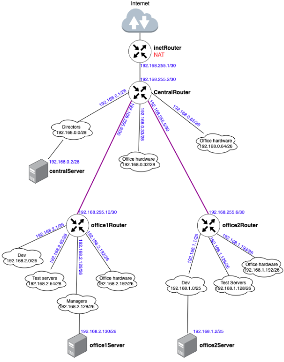

# Архитектура сетей

**Описание домашнего задания**
1. Скачать и развернуть Vagrant-стенд https://github.com/erlong15/otus-linux/tree/network
2. Построить следующую сетевую архитектуру:
Сеть office1
- 192.168.2.0/26      - dev
- 192.168.2.64/26     - test servers
- 192.168.2.128/26    - managers
- 192.168.2.192/26    - office hardware

Сеть office2
- 192.168.1.0/25      - dev
- 192.168.1.128/26    - test servers
- 192.168.1.192/26    - office hardware

Сеть central
- 192.168.0.0/28     - directors
- 192.168.0.32/28    - office hardware
- 192.168.0.64/26    - wifi

Итого должны получиться следующие сервера:
- inetRouter
- centralRouter
- office1Router
- office2Router
- centralServer
- office1Server
- office2Server

**Решение**

Изучив таблицу топологии сети и Vagrant-стенд из задания, мы можем построить полную схему сети:


Давайте рассмотрим схему: 
Знак облака означает сеть, которую необходимо будет настроить на сервере
Значки роутеров и серверов означают хосты, которые нам нужно будет создать. 

На схеме, мы сразу можем увидеть, что нам потребуется создать дополнительно 2 сети (на схеме обозначены полужирными фиолетовыми линиями):
Для соединения office1Router c centralRouter 
Для соединения office2Router c centralRouter 
На основании этой схемы мы получаем готовый список серверов.
Все виртуальные машины у нас будут работать на Ubuntu 22.04.

**Настройка NAT**
Подключиться по SSH к хосту и отключить фаерволл:
```
vagrant ssh inetRouter
systemctl stop ufw
systemctl disable ufw
```
Создаём файл /etc/iptables_rules.ipv4 и заполняем его
```
vi /etc/iptables_rules.ipv4

# Generated by iptables-save v1.8.7 on Sat Oct 14 16:14:36 2023
*filter
:INPUT ACCEPT [90:8713]
:FORWARD ACCEPT [0:0]
:OUTPUT ACCEPT [54:7429]
-A INPUT -p icmp -j ACCEPT
-A INPUT -i lo -j ACCEPT
-A INPUT -p tcp -m state --state NEW -m tcp --dport 22 -j ACCEPT
COMMIT
# Completed on Sat Oct 14 16:14:36 2023
# Generated by iptables-save v1.8.7 on Sat Oct 14 16:14:36 2023
*nat
:PREROUTING ACCEPT [1:44]
:INPUT ACCEPT [1:44]
:OUTPUT ACCEPT [0:0]
:POSTROUTING ACCEPT [0:0]
-A POSTROUTING ! -d 192.168.0.0/16 -o eth0 -j MASQUERADE
COMMIT
# Completed on Sat Oct 14 16:14:36 2023
```
Создаём файл, в который добавим скрипт автоматического восстановления правил при перезапуске системы и накидываем права:
```
vi /etc/network/if-pre-up.d/iptables

#!/bin/sh
/sbin/iptables-restore < /etc/iptables_rules.ipv4
sudo chmod +x /etc/network/if-pre-up.d/iptables
reboot
```


