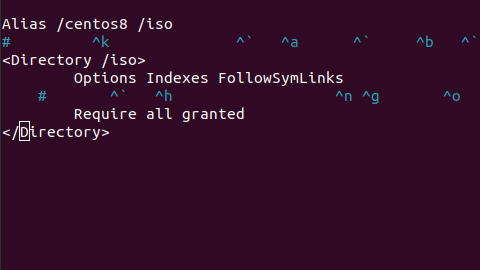
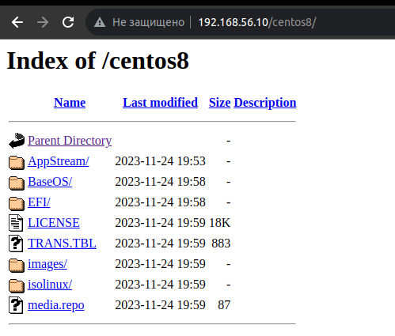

# Vagrant-стенд c PXE

**Описание домашнего задания**
1. Следуя шагам из документа https://docs.centos.org/en-US/8-docs/advanced-install/assembly_preparing-for-a-network-install  установить и настроить загрузку по сети для дистрибутива CentOS 8.
В качестве шаблона воспользуйтесь репозиторием https://github.com/nixuser/virtlab/tree/main/centos_pxe 
2. Поменять установку из репозитория NFS на установку из репозитория HTTP.
3. Настроить автоматическую установку для созданного kickstart файла (*) Файл загружается по HTTP.

**Решение**

После внесения всех изменений запускаем стэнд
```
vagrant up
vagrant ssh pxeserver
sudo -i
```
Настраиваем Web server
```
sed -i 's/mirrorlist/#mirrorlist/g' /etc/yum.repos.d/CentOS-Linux-*
sed -i 's|#baseurl=http://mirror.centos.org|baseurl=http://vault.centos.org|g' /etc/yum.repos.d/CentOS-Linux-*
yum install httpd
vi /etc/httpd/conf.d/pxeboot.conf
```
Вносим в конфиг файл следующие данные (кстати, в ДЗ ошибка, нет "</Directory>", без нее, естесвенно, апач не запускается):


Работаем с iso образом (кстати, ссылка внутри ДЗ нерабочая, образ удален, еще и сертифкат на топ репо истек!)
```
wget https://vault.centos.org/8.4.2105/isos/x86_64/CentOS-8.4.2105-x86_64-dvd1.iso
mount -t iso9660 CentOS-8.4.2105-x86_64-dvd1.iso /mnt -o loop,ro
mkdir /iso
cp -r /mnt/* /iso
chmod -R 755 /iso
```
Перезапускаем Апач и проверяем доступность файлов по сети
```
systemctl restart httpd
systemctl enable httpd
```



