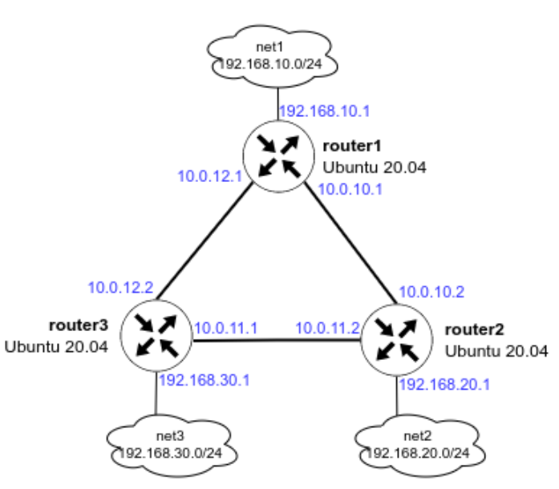

# OSPF

**Цель домашнего задания**

Создать домашнюю сетевую лабораторию. Научится настраивать протокол OSPF в Linux-based системах.

**Описание домашнего задания**

1. Развернуть 3 виртуальные машины
2. Объединить их разными vlan
* настроить OSPF между машинами на базе Quagga;
* изобразить ассиметричный роутинг;
* сделать один из линков "дорогим", но что бы при этом роутинг был симметричным. 


**Решение**

## Пошаговая инструкция выполнения домашнего задания

Все дальнейшие действия были проверены при использовании Vagrant 2.2.19, VirtualBox v6.1.26 r145957. В качестве ОС на хостах установлена Ubuntu 20.04.  
Серьёзные отступления от этой конфигурации могут потребовать адаптации с вашей стороны.

### Разворачиваем 3 виртуальные машины

Так как мы планируем настроить OSPF, все 3 виртуальные машины должны быть соединены между собой (разными VLAN), а также иметь одну (или несколько) доолнительных сетей, к которым, далее OSPF сформирует маршруты. Исходя из данных требований, мы можем нарисовать топологию сети:



Создаём каталог, в котором будут храниться настройки виртуальной машины. Помещаем Vagrantfile:

В данный Vagrantfile уже добавлен модуль запуска Ansible-playbook.

Поднимаем ВМки vagrant up

Результатом выполнения данной команды будут 3 созданные виртуальные машины, которые соединены между собой сетями (10.0.10.0/30, 10.0.11.0/30 и 10.0.12.0/30). У каждого роутера есть дополнительная сеть:

- на router1 — 192.168.10.0/24
- на router2 — 192.168.20.0/24
- на router3 — 192.168.30.0/24

На данном этапе ping до дополнительных сетей (192.168.10-30.0/24) с соседних роутеров будет недоступен.

Для подключения к ВМ нужно ввести команду vagrant ssh <имя машины>, например vagrant ssh router1

Далее потребуется переключиться в root пользователя: sudo -i

Далее все примеры команд будут указаны от пользователя root.

### Первоначальная настройка Ansible

Для настроки хостов с помощью Ansible нам нужно создать несколько файлов и  положить их в отдельную папку (в моём примере имя папки ansible):

#### Конфигурационный файл: ansible.cfg — файл описывает базовые настройки для работы Ansible:

```bash
[defaults]
# Отключение проверки ключа хоста
host_key_checking = false
# Указываем имя файла инвентаризации
inventory = hosts
# Отключаем игнорирование предупреждений
command_warnings= false
```

#### Файл инвентаризации hosts — данный файл хранит информацию о том, как подключиться к хосту:

```bash
[routers]
router1 ansible_host=192.168.50.10 ansible_user=vagrant ansible_ssh_private_key_file=.vagrant/machines/router1/virtualbox/private_key
router2 ansible_host=192.168.50.11 ansible_user=vagrant ansible_ssh_private_key_file=.vagrant/machines/router2/virtualbox/private_key
router3 ansible_host=192.168.50.12 ansible_user=vagrant ansible_ssh_private_key_file=.vagrant/machines/router3/virtualbox/private_key
```

- [servers] - в квадратных скобках указана группа хостов
- router1 — имя нашего хоста (имена хостов и групп не могут быть одинаковые)
- ansible_host — адрес нашего хоста
- ansible_user — имя пользователя, с помощью которого Ansible будет подключаться к хосту
- ansible_ssh_private_key — адрес расположения ssh-ключа
- В файл инвентаризации также можно добовлять переменные, которые могут автоматически добавляться в jinja template. Добавление переменных будет рассмотрено далее.

#### Ansible-playbook provision.yml — основной файл, в котором содержатся инструкции (модули) по настройке для Ansible

#### Дополнительно можно создать каталоги для темплейтов конфигурационных файлов (templates) и файлов с переменными (defaults)

#### Далее примеры с Ansible буду опускать

### Установка пакетов для тестирования и настройки OSPF

Перед настройкой FRR рекомендуется поставить базовые программы для изменения конфигурационных файлов (vim) и изучения сети (traceroute, tcpdump, net-tools):

```bash
apt update
apt install vim traceroute tcpdump net-tools
```

### Настройка OSPF между машинами на базе Quagga

Пакет Quagga перестал развиваться в 2018 году. Ему на смену пришёл пакет FRR, он построен на базе Quagga и продолжает своё развитие. В данном руководстве настойка OSPF будет осуществляться в FRR.

Процесс установки FRR и настройки OSPF вручную:

- Отключаем файерволл ufw и удаляем его из автозагрузки:

```bash
systemctl stop ufw
systemctl disable ufw
```

- Добавляем gpg ключ:

```bash
curl -s https://deb.frrouting.org/frr/keys.asc | sudo apt-key add -
```

- Добавляем репозиторий c пакетом FRR:

```bash
echo deb https://deb.frrouting.org/frr $(lsb_release -s -c) frr-stable > /etc/apt/sources.list.d/frr.list
```

- Обновляем пакеты и устанавливаем FRR:

```bash
sudo apt update
sudo apt install frr frr-pythontools -y
```

- Разрешаем (включаем) маршрутизацию транзитных пакетов:

```bash
sysctl net.ipv4.conf.all.forwarding=1
```

- Включаем демон ospfd в FRR

Для этого открываем в редакторе файл /etc/frr/daemons и меняем в нём параметры для пакетов zebra и ospfd на yes:

vim /etc/frr/daemons

```bash
zebra=yes
ospfd=yes
bgpd=no
ospf6d=no
ripd=no
ripngd=no
isisd=no
pimd=no
ldpd=no
nhrpd=no
eigrpd=no
babeld=no
sharpd=no
pbrd=no
bfdd=no
fabricd=no
vrrpd=no
pathd=no
```

> В примере показана только часть файла

- Настройка OSPF

Для настройки OSPF нам потребуется создать файл /etc/frr/frr.conf который будет содержать в себе информацию о требуемых интерфейсах и OSPF. Разберем пример создания файла на хосте router1.

Для начала нам необходимо узнать имена интерфейсов и их адреса. Сделать это можно с помощью двух способов:

- Посмотреть в linux: ip a | grep inet

```bash
ip a | grep "inet"
    inet 127.0.0.1/8 scope host lo
    inet6 ::1/128 scope host 
    inet 10.0.2.15/24 brd 10.0.2.255 scope global dynamic enp0s3
    inet6 fe80::72:baff:fec6:68ac/64 scope link 
    inet 10.0.10.1/24 brd 10.0.10.255 scope global enp0s8
    inet 10.0.10.1/30 brd 10.0.10.3 scope global enp0s8
    inet6 fe80::a00:27ff:feb3:f999/64 scope link 
    inet 10.0.12.1/24 brd 10.0.12.255 scope global enp0s9
    inet 10.0.12.1/30 brd 10.0.12.3 scope global enp0s9
    inet6 fe80::a00:27ff:fe9c:e1c4/64 scope link 
    inet 192.168.10.1/24 brd 192.168.10.255 scope global enp0s10
    inet6 fe80::a00:27ff:fee7:4bbf/64 scope link 
    inet 192.168.50.10/24 brd 192.168.50.255 scope global enp0s16
    inet6 fe80::a00:27ff:fe17:ca0c/64 scope link
```

- Зайти в интерфейс FRR и посмотреть информацию об интерфейсах

```bash
vtysh

Hello, this is FRRouting (version 8.2.2).
Copyright 1996-2005 Kunihiro Ishiguro, et al.

show interface brief

Interface       Status  VRF             Addresses
---------       ------  ---             ---------
enp0s3          up      default         10.0.2.15/24
enp0s8          up      default         10.0.10.1/30
enp0s9          up      default         10.0.12.1/30
enp0s10         up      default         192.168.10.1/24
enp0s16         up      default         192.168.50.10/24
lo              up      default   

exit
```

В обоих примерах мы увидем имена сетевых интерфейсов, их ip-адреса и маски подсети. Исходя из схемы мы понимаем, что для настройки OSPF нам достаточно описать интерфейсы enp0s8, enp0s9, enp0s10

Создаём файл /etc/frr/frr.conf и вносим в него следующую информацию:

```bash
!Указание версии FRR
frr version 8.2.2
frr defaults traditional
!Указываем имя машины
hostname router1
log syslog informational
no ipv6 forwarding
service integrated-vtysh-config
!
!Добавляем информацию об интерфейсе enp0s8
interface enp0s8
  !Указываем имя интерфейса
  description r1-r2
  !Указываем ip-aдрес и маску (эту информацию мы получили в прошлом шаге)
  ip address 10.0.10.1/30
  !Указываем параметр игнорирования MTU
  ip ospf mtu-ignore
  !Если потребуется, можно указать «стоимость» интерфейса
  !ip ospf cost 1000
  !Указываем параметры hello-интервала для OSPF пакетов
  ip ospf hello-interval 10
  !Указываем параметры dead-интервала для OSPF пакетов
  !Должно быть кратно предыдущему значению
  ip ospf dead-interval 30
!
interface enp0s9
  description r1-r3
  ip address 10.0.12.1/30
  ip ospf mtu-ignore
  !ip ospf cost 45
  ip ospf hello-interval 10
  ip ospf dead-interval 30
!  
interface enp0s10
  description net_router1
  ip address 192.168.10.1/24
  ip ospf mtu-ignore
  !ip ospf cost 45
  ip ospf hello-interval 10
  ip ospf dead-interval 30
!
!Начало настройки OSPF
router ospf
  !Указываем router-id
  router-id 1.1.1.1
  !Указываем сети, которые хотим анонсировать соседним роутерам
  network 10.0.10.0/30 area 0
  network 10.0.12.0/30 area 0
  network 192.168.10.0/24 area 0
  !Указываем адреса соседних роутеров
  neighbor 10.0.10.2
  neighbor 10.0.12.2
!  
!Указываем адрес log-файла
log file /var/log/frr/frr.log
default-information originate always
```

Сохраняем изменения и выходим из данного файла.

Вместо файла frr.conf мы можем задать данные параметры вручную из vtysh. Vtysh использует cisco-like команды.

На хостах router2 и router3 также потребуется настроить конфигруационные файлы, предварительно поменяв ip -адреса интерфейсов.


- После создания файлов /etc/frr/frr.conf и /etc/frr/daemons нужно проверить, что владельцем файла является пользователь frr. Группа файла также должна быть frr. 

Должны быть установленны следующие права:

- у владельца на чтение и запись
- у группы только на чтение

```bash
ls -l /etc/frr

total 20
-rw-r----- 1 frr frr 2620 Jul  6 20:57 daemons
-rw-r----- 1 frr frr 2404 Jul  6 21:05 frr.conf
-rw-r----- 1 frr frr 5411 Mar 13 20:43 support_bundle_commands.conf
-rw-r----- 1 frr frr   32 Mar 13 20:43 vtysh.conf
```

Если права или владелец файла указан неправильно, то нужно поменять владельца и назначить правильные права, например:

```bash
chown frr:frr /etc/frr/frr.conf
chmod 640 /etc/frr/frr.conf
```

- Перезапускаем FRR и добавляем его в автозагрузку

```bash
systemctl restart frr
systemctl enable frr
```

- Проверям, что OSPF перезапустился без ошибок

```bash
systemctl status frr
```

Если мы правильно настроили OSPF, то с любого хоста нам должны быть доступны сети:

- 192.168.10.0/24
- 192.168.20.0/24
- 192.168.30.0/24
- 10.0.10.0/30
- 10.0.11.0/30
- 10.0.13.0/30


### Настройка ассиметричного роутинга

Для настройки ассиметричного роутинга нам необходимо выключить блокировку ассиметричной маршрутизации: sysctl net.ipv4.conf.all.rp_filter=0

Далее, выбираем один из роутеров, на котором изменим «стоимость интерфейса». Например поменяем стоимость интерфейса enp0s8 на router1:

```bash
vtysh

Hello, this is FRRouting (version 8.2.2).
Copyright 1996-2005 Kunihiro Ishiguro, et al.

conf t
int enp0s8
ip ospf cost 1000
exit
exit
show ip route ospf

```

На router2

```bash
vtysh

Hello, this is FRRouting (version 8.2.2).
Copyright 1996-2005 Kunihiro Ishiguro, et al.

show ip route ospf

```

После внесения данных настроек, мы видим, что маршрут до сети 192.168.20.0/30 теперь пойдёт через router3, но обратный трафик от router2 пойдёт по другому пути.


Так как у нас уже есть один «дорогой» интерфейс, нам потребуется добавить ещё один дорогой интерфейс, чтобы у нас перестала работать ассиметричная маршрутизация.

Так как в прошлом задании мы заметили что router2 будет отправлять обратно трафик через порт enp0s8, мы также должны сделать его дорогим и далее проверить, что теперь используется симметричная маршрутизация:

Поменяем стоимость интерфейса enp0s8 на router2:

```bash
vtysh

Hello, this is FRRouting (version 8.2.2).
Copyright 1996-2005 Kunihiro Ishiguro, et al.

conf t
int enp0s8
ip ospf cost 1000
exit
exit

show ip route ospf

Codes: K - kernel route, C - connected, S - static, R - RIP,
       O - OSPF, I - IS-IS, B - BGP, E - EIGRP, N - NHRP,
       T - Table, v - VNC, V - VNC-Direct, A - Babel, F - PBR,
       f - OpenFabric,
       > - selected route, * - FIB route, q - queued, r - rejected, b - backup
       t - trapped, o - offload failure

O   10.0.10.0/30 [110/1000] is directly connected, enp0s8, weight 1, 00:00:10
O   10.0.11.0/30 [110/100] is directly connected, enp0s9, weight 1, 00:24:23
O>* 10.0.12.0/30 [110/200] via 10.0.11.1, enp0s9, weight 1, 00:00:10
O>* 192.168.10.0/24 [110/300] via 10.0.11.1, enp0s9, weight 1, 00:00:10
O   192.168.20.0/24 [110/100] is directly connected, enp0s10, weight 1, 00:24:23
O>* 192.168.30.0/24 [110/200] via 10.0.11.1, enp0s9, weight 1, 00:23:43

exit
```

После внесения данных настроек, мы видим, что маршрут до сети 192.168.10.0/30 пойдёт через router3.


