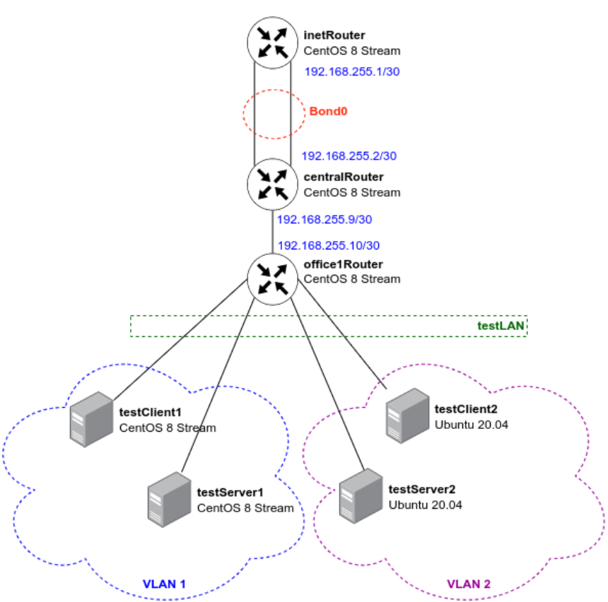

# Vagrant-стенд c VLAN и LACP

# Цель домашнего задания
Научиться настраивать VLAN и LACP.



Установка пакетов на Debian на всех машинах

```
apt install -y vim traceroute tcpdump net-tools
```
На хостах testClient2 и testClient1 требуется создать файл /etc/netplan/50-cloud-init.yaml со следующим параметрами:
```
# This file is generated from information provided by the datasource.  Changes
# to it will not persist across an instance reboot.  To disable cloud-init's
# network configuration capabilities, write a file
# /etc/cloud/cloud.cfg.d/99-disable-network-config.cfg with the following:
# network: {config: disabled}
network:
    version: 2
    ethernets:
        enp0s3:
            dhcp4: true
        #В разделе ethernets добавляем порт, на котором будем настраивать VLAN
        enp0s8: {}
    #Настройка VLAN
    vlans:
        #Имя VLANа
        vlan2:
          #Указываем номер VLAN`а
          id: 2
          #Имя физического интерфейса
          link: enp0s8
          #Отключение DHCP-клиента
          dhcp4: no
          #Указываем ip-адрес
          addresses: [10.10.10.254/24]
```
На хосте testServer1 и testServer2 создадим идентичный файл с другим IP-адресом (10.10.10.1).

После создания файлов нужно перезапустить сеть на обоих хостах: 
```
netplan apply
```

#Настройка LACP между хостами inetRouter и centralRouter
Изначально необходимо на обоих хостах добавить конфигурационные файлы для интерфейсов eth1 и eth2:

vim /etc/sysconfig/network-scripts/ifcfg-eth1
```
#Имя физического интерфейса
DEVICE=eth1
#Включать интерфейс при запуске системы
ONBOOT=yes
#Отключение DHCP-клиента
BOOTPROTO=none
#Указываем, что порт часть bond-интерфейса
MASTER=bond0
#Указыаваем роль bond
SLAVE=yes
NM_CONTROLLED=yes
USERCTL=no
```

У интерфейса ifcfg-eth2 идентичный конфигурационный файл, в котором нужно изменить имя интерфейса. 

2) После настройки интерфейсов eth1 и eth2 нужно настроить bond-интерфейс, для этого создадим файл /etc/sysconfig/network-scripts/ifcfg-bond0
```
vim /etc/sysconfig/network-scripts/ifcfg-bond0

DEVICE=bond0
NAME=bond0
#Тип интерфейса — bond
TYPE=Bond
BONDING_MASTER=yes
#Указаваем IP-адрес 
IPADDR=192.168.255.1
#Указываем маску подсети
NETMASK=255.255.255.252
ONBOOT=yes
BOOTPROTO=static
#Указываем режим работы bond-интерфейса Active-Backup
# fail_over_mac=1 — данная опция «разрешает отвалиться» одному интерфейсу
BONDING_OPTS="mode=1 miimon=100 fail_over_mac=1"
NM_CONTROLLED=yes
```

После создания данных конфигурационных файлов неоьходимо перзапустить сеть:
```
systemctl restart NetworkManager
```

