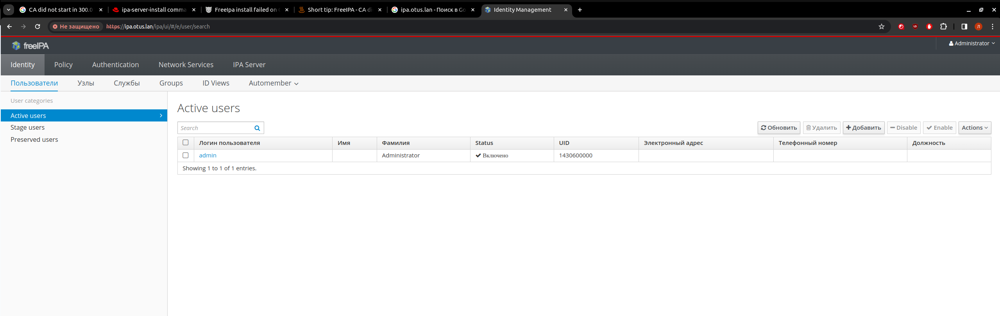
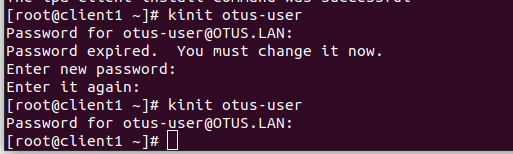

# Vagrant-стенд c LDAP на базе FreeIPA

# Цель домашнего задания
Научиться настраивать LDAP-сервер и подключать к нему LDAP-клиентов

# Примичание
Т.к. CentOS 8Stream нет на вагранте, дз делалось на CentOS 7

# Выполнение
Настройка FreeIPA сервера:

Установим часовой пояс. Chrony не надо устанавливать и настраивать. т.к. изначально присутсвует в данном дистрибутиве

```
timedatectl set-timezone Europe/Moscow
```

Настроим фаерволл и SELinux

```
systemctl stop firewalld
systemctl disable firewalld
setenforce 0
```
Поменяем в файле /etc/selinux/config, параметр Selinux на disabled
vi /etc/selinux/config

Правим файл hosts

```
vi /etc/hosts
```
Установим FreeIPA-сервер: 

```
yum install -y ipa-server
```

ВАЖНО! Обновим nss, без него не стартует демон, отвечающий за выпуск сертификата!

```
yum update nss*
```

Запустим скрипт установки: 

```
ipa-server-install
```

После установки проверяем, работает ли сервер, путем захода на веб интерфейс:



Настраиваем клиенты в соотвествии с Ansible playbook

Проверяем работу LDAP, путем команды kinit otus-user



На этом процесс добавления хостов к FreeIPA-серверу завершен.
